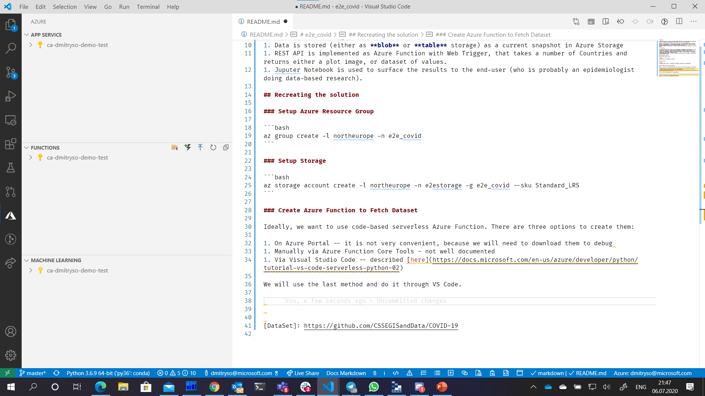
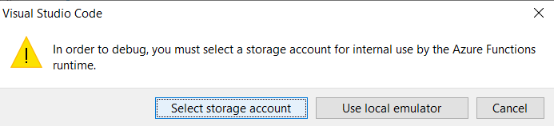
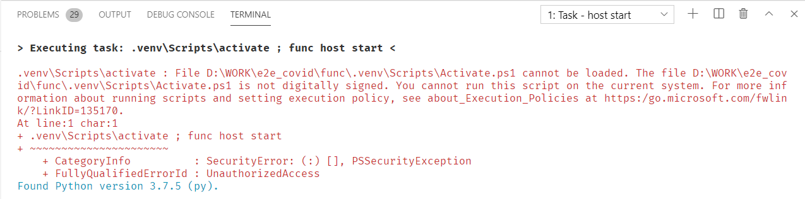

# e2e_covid

> End-to-end scenario of creating a queryable COVID-19 data service to return effective reproductive number for different countries based on [John Hopkins University dataset][DataSet]

The goal of this project is to create a service that would return COVID epidemic data on different countries, including numbers of infected/recovered people, as well as effective reproductive number, which is calculated based on [this post][https://soshnikov.com/science/sliding-sir-model-for-rt-estimation/]. We then call this service from Jupyter Notebook to surface the results.

## Architecture

1. Live data from the [dataset GitHub repository][DataSet] is automatically fetched once a day by an Azure Function `daily_fetch`, which processes the data and calculates Rt for all countries.
1. Data is stored (either as **blob** or **table** storage) as a current snapshot in Azure Storage
1. REST API is implemented as Azure Function with Web Trigger, that takes a number of Countries and returns either a plot image, or dataset of values.
1. Juputer Notebook is used to surface the results to the end-user (who is probably an epidemiologist doing data-based research).

## Recreating the solution

### Setup Azure Resource Group

```bash
az group create -l northeurope -n e2e_covid
```

### Setup Storage

```bash
az storage account create -l northeurope -n e2estorage -g e2e_covid --sku Standard_LRS
```

### Create Azure Function to Fetch Dataset

Ideally, we want to use code-based serverless Azure Function. There are three options to create them:

1. On Azure Portal -- it is not very convenient, because we will need to download them to debug 
1. Manually via Azure Function Core Tools - not well documented
1. Via Visual Studio Code -- described [here](https://docs.microsoft.com/azure/developer/python/tutorial-vs-code-serverless-python-02?WT.mc_id=academic-0000-dmitryso)

We will use the last method and do it through VS Code.

1. In the Azure tab, find "FUNCTIONS" section and click "Create new project"

1. Select **Python** as a language, create virtual environment, and then create `daily_fetch` function based on **Timer** template with default schedule.
1. Now try to run the function. The first time you do it, it will prompt to select storage account --- select the one we have created earlier.


When running the function with virtual environment created in this manner, you may encounted the following error in the **TERMINAL** window below:
```
.venv\Scripts\activate : File D:\WORK\e2e_covid\func\.venv\Scripts\Activate.ps1 cannot be loaded. The file D:\WORK\e2e_covid\func\.venv\Scripts\Activate.ps1 is not digitally signed. You cannot run this script on the current system. For more information about running scripts and setting execution policy, see about_Execution_Policies at https:/go.microsoft.com/fwlink/?LinkID=135170.
At line:1 char:1
+ .venv\Scripts\activate ; func host start
+ ~~~~~~~~~~~~~~~~~~~~~~
    + CategoryInfo          : SecurityError: (:) [], PSSecurityException
    + FullyQualifiedErrorId : UnauthorizedAccess
```


To correct this error:

1. Start Powershell Prompt with Administrator privileges
1. Execute the following command:
```powershell
Set-ExecutionPolicy Unrestricted
```


[DataSet]: https://github.com/CSSEGISandData/COVID-19
